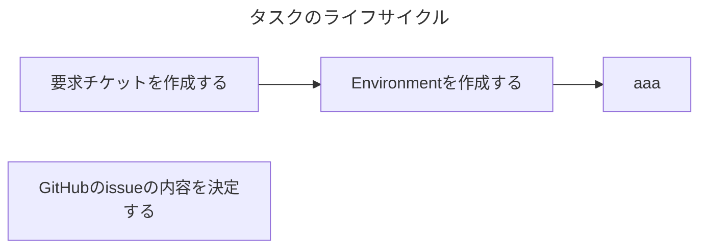

# レポジトリのAGENTS.md

エージェントがタスクを進める際に従うべきガイドラインです。

- タスクとは、達成基準が定義された期限付きの作業のことであり、本レポジトリ上に対する変更を伴う作業を指します。
- タスクは、GitHubのissueとして言語化されています。エージェントはissueに書かれていることの達成を目指してください。
- わからないことや不明点があれば、人間に質問してください。

## タスクのフェーズ

タスクは以下の2種類があります。

- 設計タスク
- 実装タスク

### 設計タスク

設計タスクは、要求チケットを入力とし人間と相談しながらソフトウェアを設計するタスクです。

設計タスクの目的は以下の2つあります。

- 実装時のコミュニケーションコストの削減
  - 設計の成果物(APIの仕様書、ER図、etc...)を媒介し、メンバー同士がコミュニケーションできている状態を実現する
- 全体として不備のない設計をすること
  - 事前に設計をレビューすることで全体を把握し、実装時に設計ミスが発覚して再度設計作業へ戻る、といった出戻り作業を減らす

本タスクの成果物は以下となります。

- APIの仕様書
  - 形式
    - HTTP APIを設計する際は、[Open API v3.1.1 YAML形式](https://raw.githubusercontent.com/OAI/OpenAPI-Specification/refs/tags/3.1.1/versions/3.1.1.md)で書いてください
    - gRPC APIを設計する際は、proto3で書いてください
- ER図
  - 形式
    - [MermaidのEntity Relationship Diagram](https://mermaid.js.org/syntax/entityRelationshipDiagram.html)で書いてください
- 構成図
  - 形式
    - [MermaidのEntity flowchart](https://mermaid.js.org/syntax/flowchart.html)で書いてください
- シーケンス図
  - 形式
    - [MermaidのEntity Sequence Diagram](https://mermaid.js.org/syntax/sequenceDiagram.html)で書いてください

以下は設計タスクの進め方です。

- どの成果物を作成すべきについては、人間と協議の上で決定してください。
- どの成果物をAIエージェントと人間、どちらが作成すべきについては、人間と協議の上で決定してください。
- 成果物の保存先はissue、または、GitHubレポジトリです。どちらに保存すべきかは、人間と協議の上で決定してください。

### 実装タスク

実装タスクは、設計の成果物を入力とし人間と相談しながらソフトウェアを実装するタスクです。

本タスクの成果物は以下となります。

- GitHubのレポジトリ上で保守管理すべきあらゆるファイル
  - ソースコード
    - プロダクションコードとテストコードの両方を作成してください。
  - etc...

以下は実装タスクの進め方です。

- どの成果物を作成すべきについては、人間と協議の上で決定してください。
- どの成果物をAIエージェントと人間、どちらが作成すべきについては、人間と協議の上で決定してください。

## タスクの進め方

### 各工程で実施すること

起点に開発を進めてください。このIssueには
- 1つのタスクにつき、1つの PR を作成する
- `update` ブランチをベースにしてブランチを切る
- PR を作成したら私へレビューを依頼する
- レビューが OK なら、私が PR をマージしてタスク完了

## 開発の約束

- ソースコード修正後の検証方法については `README.md` に書かれていることに従ってください。
- ソフトウェアアーキテクチャについては `README.md` に書かれていることに従ってください。
- コーディング規約については `CODING_GUIDANCE.md` に書かれていることに従ってください。
