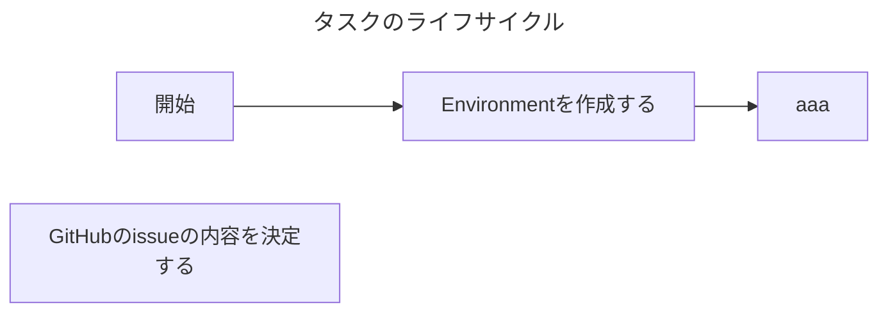

# AGENTS.md

エージェントがタスクを進める際に従うべきガイドラインです。

- タスクとは、達成基準が定義された期限付きの作業のことであり、本レポジトリ上に対する変更を伴う作業を指します。
- タスクは、GitHubのissueとして言語化されています。エージェントはissueに書かれていることに従ってください。

## エージェントによるタスクの進め方

エージェントは以下のフローに従ってタスクを進めてください。

### 各工程で実施すること

起点に開発を進めてください。このIssueには
- 1つのタスクにつき、1つの PR を作成する
- `update` ブランチをベースにしてブランチを切る
- PR を作成したら私へレビューを依頼する
- レビューが OK なら、私が PR をマージしてタスク完了

## 開発の約束

- ソースコード修正後の検証方法については `README.md` に書かれていることに従ってください。
- ソフトウェアアーキテクチャについては `README.md` に書かれていることに従ってください。
- コーディング規約については `CODING_GUIDANCE.md` に書かれていることに従ってください。
