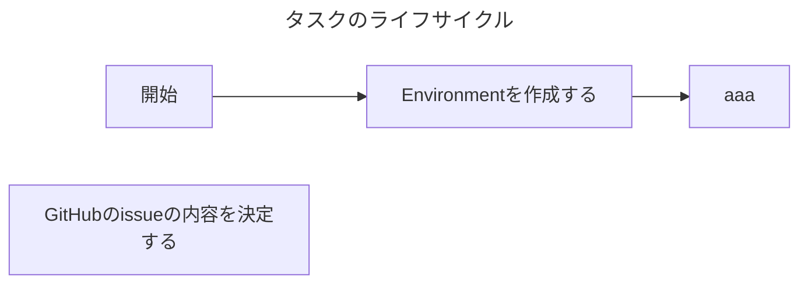

# AGENTS.md

エージェントがタスクを進める際に従うべきガイドラインです。
タスクとは、達成基準が定義された期限付きの作業のことであり、本レポジトリ上に対する変更を伴う作業を指します。

## エージェントによるタスクの進め方

エージェントは以下のフローに従ってタスクを進めてください。

### 各工程で実施すること

#### GitHubのissueの内容を決定する

タスクをissueに

- issueの「ゴール」には、タスクの達成基準を箇条書きで書いてください
  - 1つの項目には1つの達成基準を書いてください
  - 達成基準を可能な限り訂正的に定量的に表現してください
  - ただし、達成基準を定性的に書いていただいても構いません
- issueの「制約」には、守らなければならない制約を書いてください
  - 1つの項目には1つの制約を書いてください
  - 制約を可能な限り訂正的に定量的に表現してください
  - ただし、制約を定性的に書いていただいても構いません
- issueの「背景」に、下記を自由入力テキストで書いてください
  - ゴールを達成しなければならない理由を書いてください
  - ゴールの決定経緯を書いてください
- issueの「サブタスク一覧」に、サブタスクを書いてください
  - サブタスクの「ゴール」には、サブタスクの達成基準を箇条書きで書いてください
    - 1つの項目には1つの達成基準を書いてください
    - 達成基準を可能な限り訂正的に定量的に表現してください
    - ただし、達成基準を定性的に書いていただいても構いません
  - サブタスクの「制約」には、守らなければならない制約を書いてください
    - 1つの項目には1つの制約を書いてください
    - 制約を可能な限り訂正的に定量的に表現してください
    - ただし、制約を定性的に書いていただいても構いません
  - サブタスクにはPRのURLを掲載してください

GitHubのissueを作成してください

起点に開発を進めてください。このIssueには
- 1つのタスクにつき、1つの PR を作成する
- `update` ブランチをベースにしてブランチを切る
- PR を作成したら私へレビューを依頼する
- レビューが OK なら、私が PR をマージしてタスク完了

## 開発の約束

- ソースコード修正後の検証方法については `README.md` に書かれていることに従ってください。
- ソフトウェアアーキテクチャについては `README.md` に書かれていることに従ってください。
- コーディング規約については `CODING_GUIDANCE.md` に書かれていることに従ってください。
