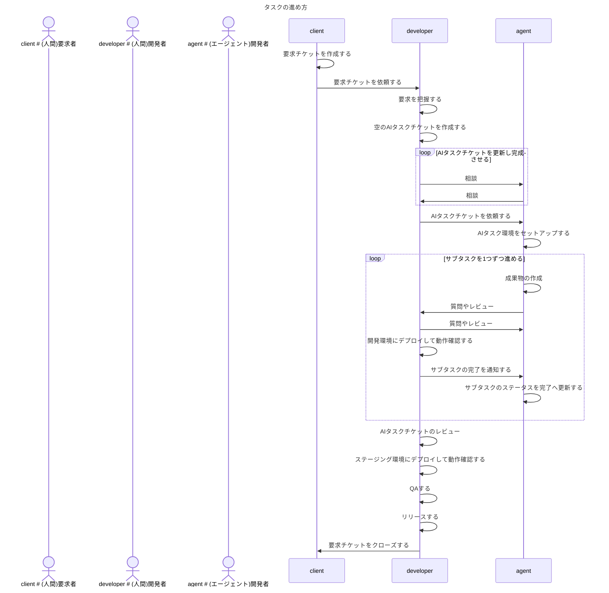

# レポジトリのAGENTS.md

エージェントがタスクを進める際に従うべきガイドラインです。

- タスクとは、達成基準が定義された期限付きの作業のことであり、本レポジトリ上に対する変更を伴う作業を指します。
- タスクは、GitHubのissueとして言語化されています。エージェントはissueに書かれていることの達成を目指してください。
- わからないことや不明点があれば、人間に質問してください。

エージェントと人間の役割分担

- エージェントの責務
  - エージェントは成果物を作成して下さい
  - 成果物はフェーズによって異なります。何が成果物かは人間に聞いて下さい
  - 人間の質問に答えて下さい
  - アイディアを出して下さい
- 人間の責務
  - エージェントが作成した成果物をレビューして下さい
  - 意思決定をして下さい

## タスクのフェーズ

タスクは以下の2種類があります。

- 設計タスク
- 実装タスク

### 設計タスク

設計タスクは、要求チケットを入力とし人間と相談しながらソフトウェアを設計するタスクです。

設計タスクの目的は以下の2つあります。

- 実装時のコミュニケーションコストの削減
  - 設計の成果物(APIの仕様書、ER図、etc...)を媒介し、メンバー同士がコミュニケーションできている状態を実現する
- 全体として不備のない設計をすること
  - 事前に設計をレビューすることで全体を把握し、実装時に設計ミスが発覚して再度設計作業へ戻る、といった出戻り作業を減らす

本タスクの成果物は以下となります。

- APIの仕様書
  - 形式
    - HTTP APIを設計する際は、[Open API v3.1.1 YAML形式](https://raw.githubusercontent.com/OAI/OpenAPI-Specification/refs/tags/3.1.1/versions/3.1.1.md)で書いてください
    - gRPC APIを設計する際は、proto3で書いてください
- ER図
  - 形式
    - [MermaidのEntity Relationship Diagram](https://mermaid.js.org/syntax/entityRelationshipDiagram.html)で書いてください
- 構成図
  - 形式
    - [MermaidのEntity flowchart](https://mermaid.js.org/syntax/flowchart.html)で書いてください
- シーケンス図
  - 形式
    - [MermaidのEntity Sequence Diagram](https://mermaid.js.org/syntax/sequenceDiagram.html)で書いてください

以下は設計タスクの進め方です。

- どの成果物を作成すべきについては、人間と協議の上で決定してください。
- どの成果物をAIエージェントと人間、どちらが作成すべきについては、人間と協議の上で決定してください。
- 成果物の保存先はissue、または、GitHubレポジトリです。どちらに保存すべきかは、人間と協議の上で決定してください。

### 実装タスク

実装タスクは、設計の成果物を入力とし人間と相談しながらソフトウェアを実装するタスクです。

本タスクの成果物は以下となります。

- GitHubのレポジトリ上で保守管理すべきあらゆるファイル
  - ソースコード
    - プロダクションコードとテストコードの両方を作成してください。
  - etc...

以下は実装タスクの進め方です。

- どの成果物を作成すべきについては、人間と協議の上で決定してください。
- どの成果物をAIエージェントと人間、どちらが作成すべきについては、人間と協議の上で決定してください。

## タスクの進め方

- 要求チケットを作成する
  - clientは`type: 要求`ラベルを付与したissueを作成する
- 空のAIタスクチケットを作成する
  - issueテンプレート(.github/ISSUE_TEMPLATE/ai-task.md)にissueを作成する
- AIタスクチケットを更新し完成させる
  - タスクの「タイトル」「ゴール」「制約」「背景」を入力する
    - 「タイトル」の書き方
      - タイトルを見ただけでそのチケットの内容がわかるようになっていると嬉しいです
    - 「ゴール」の書き方
      - 1つの項目には1つの達成基準を書いてください
      - 達成基準を可能な限り訂正的に定量的に表現してください
      - ただし、達成基準を定性的に書いていただいても構いません
    - 「制約」の書き方
      - 1つの項目には1つの制約を書いてください
      - 制約を可能な限り訂正的に定量的に表現してください
      - ただし、制約を定性的に書いていただいても構いません
    - 「背景」の書き方
      - ゴールを達成しなければならない理由を書いてください
      - ゴールの決定経緯を書いてください
  - タスクをサブタスクへ分解する
    - サブタスクの粒度は「1人が実行して2時間で完了する」です
- AIタスク環境をセットアップする
  - mainブランチをbaseブランチとし、新しいブランチを作成する。このブランチをfeatureブランチと呼ぶ
  - ブランチ名の命名規則は以下の通り
    - `iss-<issue番号>`
  - (必要であれば)CodeX CloudのEnvironmentを作成する
- サブタスクを1つずつ進める
  - featureブランチをbaseブランチとし、新しいブランチを作成する。このブランチをsub-featureブランチと呼ぶ
  - ブランチ名の命名規則は以下の通り
    - `iss-<issue番号>-<subtask番号>`
  - 変更をブランチへpushする
  - ある程度完成したらPRを作成し、コードレビューを依頼する
  - 人間は開発環境などで動作確認を実施する
  - PRがマージされたら、サブタスクを完了とし、次のサブタスクへ取り掛かる

## 開発の約束

- ソースコード修正後の検証方法については `README.md` に書かれていることに従ってください。
- ソフトウェアアーキテクチャについては `README.md` に書かれていることに従ってください。
- コーディング規約については `CODING_GUIDELINE.md` に書かれていることに従ってください。
