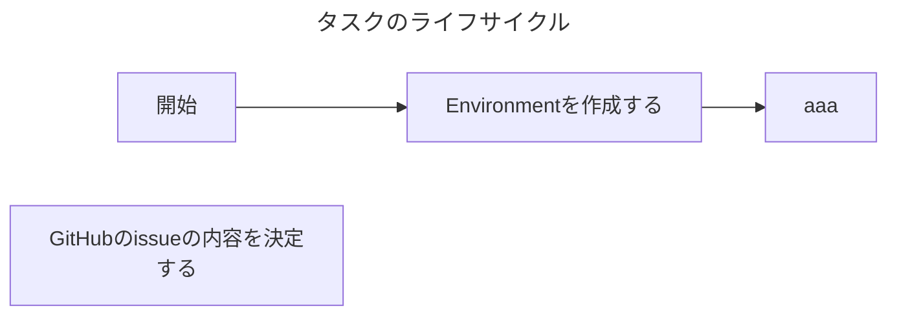

# レポジトリのAGENTS.md

エージェントがタスクを進める際に従うべきガイドラインです。

- タスクとは、達成基準が定義された期限付きの作業のことであり、本レポジトリ上に対する変更を伴う作業を指します。
- タスクは、GitHubのissueとして言語化されています。エージェントはissueに書かれていることの達成を目指してください。
- わからないことや不明点があれば、人間に質問してください。

## タスクの進め方

タスクは以下の2種類があります。

- 設計タスク
- 実装タスク

### 設計タスク

設計タスクは、要求チケットを入力とし人間と相談しながらソフトウェアを設計するタスクです。

本タスクの成果物は以下となります。

- APIの仕様書
  - 形式
    - HTTP APIを設計する際は、[Open API v3.1.1 YAML形式](https://raw.githubusercontent.com/OAI/OpenAPI-Specification/refs/tags/3.1.1/versions/3.1.1.md)で書いてください
    - gRPC APIを設計する際は、proto3で書いてください
- ER図
  - 形式
    - [MermaidのEntity Relationship Diagram](https://mermaid.js.org/syntax/entityRelationshipDiagram.html)で書いてください
- 構成図

エージェントは以下のフローに従ってタスクを進めてください。

### 各工程で実施すること

起点に開発を進めてください。このIssueには
- 1つのタスクにつき、1つの PR を作成する
- `update` ブランチをベースにしてブランチを切る
- PR を作成したら私へレビューを依頼する
- レビューが OK なら、私が PR をマージしてタスク完了

## 開発の約束

- ソースコード修正後の検証方法については `README.md` に書かれていることに従ってください。
- ソフトウェアアーキテクチャについては `README.md` に書かれていることに従ってください。
- コーディング規約については `CODING_GUIDANCE.md` に書かれていることに従ってください。
