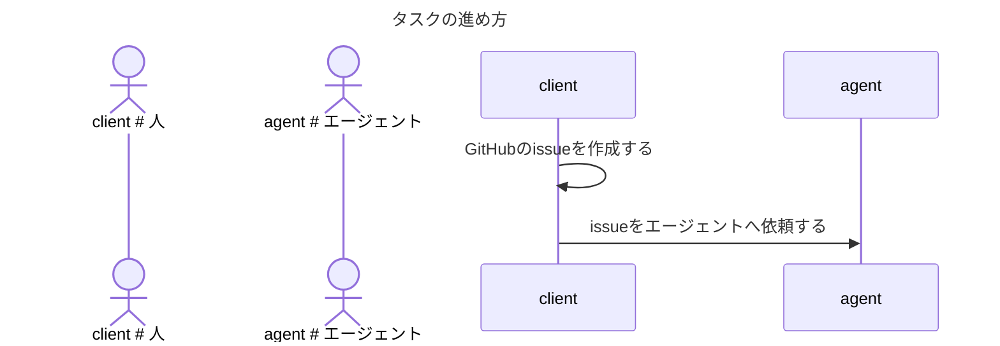

# TASKS.md

エージェントにタスクを依頼する人間が従うべきガイドラインです。
タスクとは、達成基準が定義された期限付きの作業のことであり、本レポジトリ上に対する変更を伴う作業を指します。

## タスクの進め方

### GitHubのissueを作成する

タスクをissueに

- issueの「ゴール」には、タスクの達成基準を箇条書きで書いてください
  - 1つの項目には1つの達成基準を書いてください
  - 達成基準を可能な限り訂正的に定量的に表現してください
  - ただし、達成基準を定性的に書いていただいても構いません
- issueの「制約」には、守らなければならない制約を書いてください
  - 1つの項目には1つの制約を書いてください
  - 制約を可能な限り訂正的に定量的に表現してください
  - ただし、制約を定性的に書いていただいても構いません
- issueの「背景」に、下記を自由入力テキストで書いてください
  - ゴールを達成しなければならない理由を書いてください
  - ゴールの決定経緯を書いてください
- issueの「サブタスク一覧」に、サブタスクを書いてください
  - サブタスクの「ゴール」には、サブタスクの達成基準を箇条書きで書いてください
    - 1つの項目には1つの達成基準を書いてください
    - 達成基準を可能な限り訂正的に定量的に表現してください
    - ただし、達成基準を定性的に書いていただいても構いません
  - サブタスクの「制約」には、守らなければならない制約を書いてください
    - 1つの項目には1つの制約を書いてください
    - 制約を可能な限り訂正的に定量的に表現してください
    - ただし、制約を定性的に書いていただいても構いません
  - サブタスクにはPRのURLを掲載してください

### issueをエージェントへ依頼する

考え中
