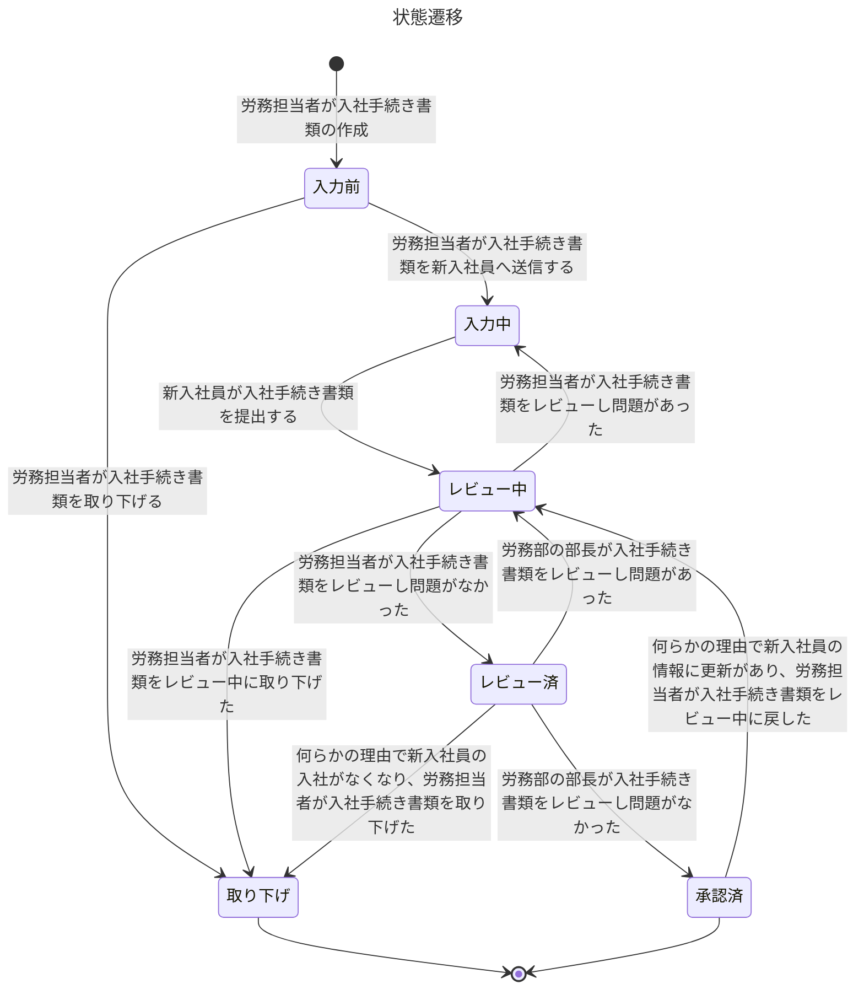

# タイトル

## 要求

ユーザーの要求を記述してください。
具体的には下記のサブ項目を記述してください。
ただし全部埋めなくても良いです。

### 対象ユーザー・文脈

「誰の、どんな状況の話か？」を記述してください。

下記の質問に答えられるようなものを目指してください。
ただし全ての質問に答える必要はありません。

- 主な対象ユーザーは誰か？
- そのユーザーはどんな立場・役割か？
- どんな業務・生活の流れの中でこの要求が発生しているか？
- いつ・どの頻度で発生する話か？

### 現在の課題・不満

「今、何がつらいのか？」を記述してください。

下記の質問に答えられるようなものを目指してください。
ただし全ての質問に答える必要はありません。

- ユーザーは何に困っているか？
- どの作業・体験が特につらいか？
- それはなぜ問題なのか？（時間・心理・コスト・リスクなど）
- どんな状態が「我慢できないライン」か？

### ユーザーの欲求・期待

「本当はどうなっていたいか？」を記述してください。

下記の質問に答えられるようなものを目指してください。
ただし全ての質問に答える必要はありません。

- ユーザーは何を達成したいのか？
- どんな状態になれば満足か？
- 何ができると「助かる」「嬉しい」と感じるか？
- 現実的でなくても、理想像は何か？

### 成功のイメージ

「これが満たされたら、何が変わるのか？」を記述してください。

下記の質問に答えられるようなものを目指してください。
ただし全ての質問に答える必要はありません。

- この要求が満たされると、ユーザーの何が変わるか？
- 業務・行動・判断はどう変化するか？
- 課題はどの程度軽減されるか？
- 逆に、満たされないと何が起き続けるか？

### 前提・スコープ外

「今回はやらないこと・割り切り」を記述してください。

下記の質問に答えられるようなものを目指してください。
ただし全ての質問に答える必要はありません。

- 今回の要求では扱わないことは何か？
- 将来やるかもしれないが、今回は対象外なものは？
- この要求を書く上で置いている前提は何か？

## 要件

### 概要

ユーザーの要求を満たすためにサービスを提供するとします。
そのサービスで満たさなければならない条件は何でしょう？
それを箇条書きで記述してください。
必ずしもWebサービスである必要はありません。

## 仕様

### 利用者

この製品のユーザーを定義してください。
下記は記入例です。
労務管理を実施するSaaSの利用者を想定しています。

- 労務部の部長
  - 概要
    - 労務部の部長さん
  - 権限
    - 労務部の部長は提出された入社手続き書類を承認できる
- 労務担当者
  - 概要
    - 部長の下で働いている、労務チームのメンバー。
  - 権限
    - 労務担当者は提出された入社手続き書類を閲覧できる
    - 労務担当者は提出された入社手続き書類を更新できる
    - 労務担当者は提出された入社手続き書類を差戻しできる
- 新入社員
  - 概要
    - 新入社員です
  - 権限
    - 新入社員は自分の入社手続き書類を閲覧できる
    - 新入社員は自分の入社手続き書類を更新できる
    - 新入社員は自分の入社手続き書類を提出できる

### 入社手続き書類の状態

要件を説明する上で何らかの状態があるならば、その状態を定義してください。
状態の遷移については、MermaidのState diagramsを用いて記述してください。

下記は記入例です。

- 入力前
  - 概要
    - 新入社員が入社手続き書類を入力する前の状態
    - 労務担当者が入社手続き書類を作成中の状態
- 入力中
  - 概要
    - 新入社員が入社手続き書類を入力中である状態
- レビュー中
  - 概要
    - 労務担当者が入社手続き書類をレビュー中である状態
- レビュー済
  - 概要
    - 労務担当者が入社手続き書類をレビュー済である状態
- 承認済
  - 概要
    - 労務部の部長が入社手続き書類を承認済である状態

### ユースケース

記述してください。
