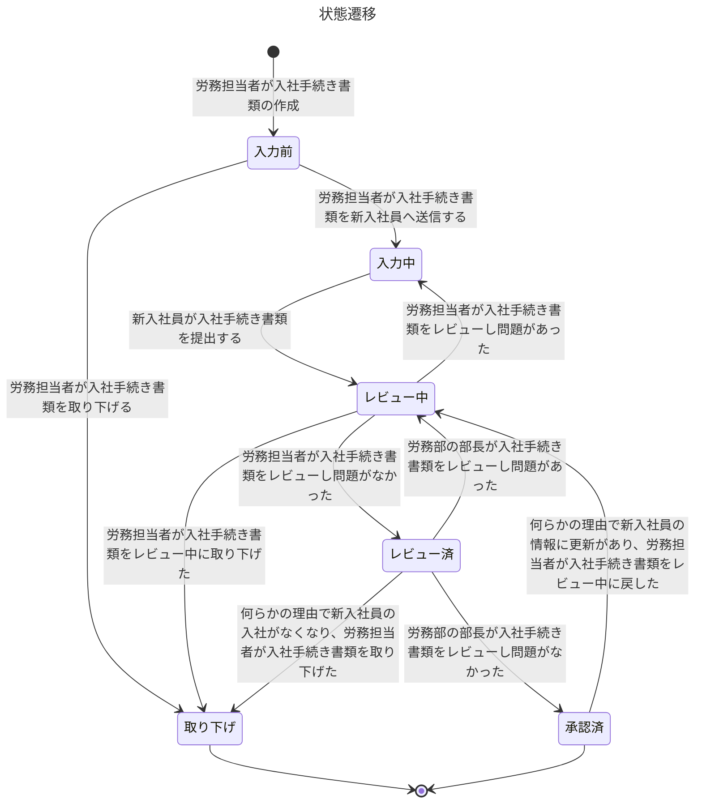

# タイトル

## 要件

### 利用者

この製品のユーザーを定義してください。
下記は記入例です。
労務管理を実施するSaaSの利用者を想定しています。

- 労務部の部長
  - 概要
    - 労務部の部長さん
  - 権限
    - 労務部の部長は提出された入社手続き書類を承認できる
- 労務担当者
  - 概要
    - 部長の下で働いている、労務チームのメンバー。
  - 権限
    - 労務担当者は提出された入社手続き書類を閲覧できる
    - 労務担当者は提出された入社手続き書類を更新できる
    - 労務担当者は提出された入社手続き書類を差戻しできる
- 新入社員
  - 概要
    - 新入社員です
  - 権限
    - 新入社員は自分の入社手続き書類を閲覧できる
    - 新入社員は自分の入社手続き書類を更新できる
    - 新入社員は自分の入社手続き書類を提出できる

### 入社手続き書類の状態

要件を説明する上で何らかの状態があるならば、その状態を定義してください。
状態の遷移については、MermaidのState diagramsを用いて記述してください。

下記は記入例です。

- 入力前
  - 概要
    - 新入社員が入社手続き書類を入力する前の状態
    - 労務担当者が入社手続き書類を作成中の状態
- 入力中
  - 概要
    - 新入社員が入社手続き書類を入力中である状態
- レビュー中
  - 概要
    - 労務担当者が入社手続き書類をレビュー中である状態
- レビュー済
  - 概要
    - 労務担当者が入社手続き書類をレビュー済である状態
- 承認済
  - 概要
    - 労務部の部長が入社手続き書類を承認済である状態

### ユースケース

記述してください。
