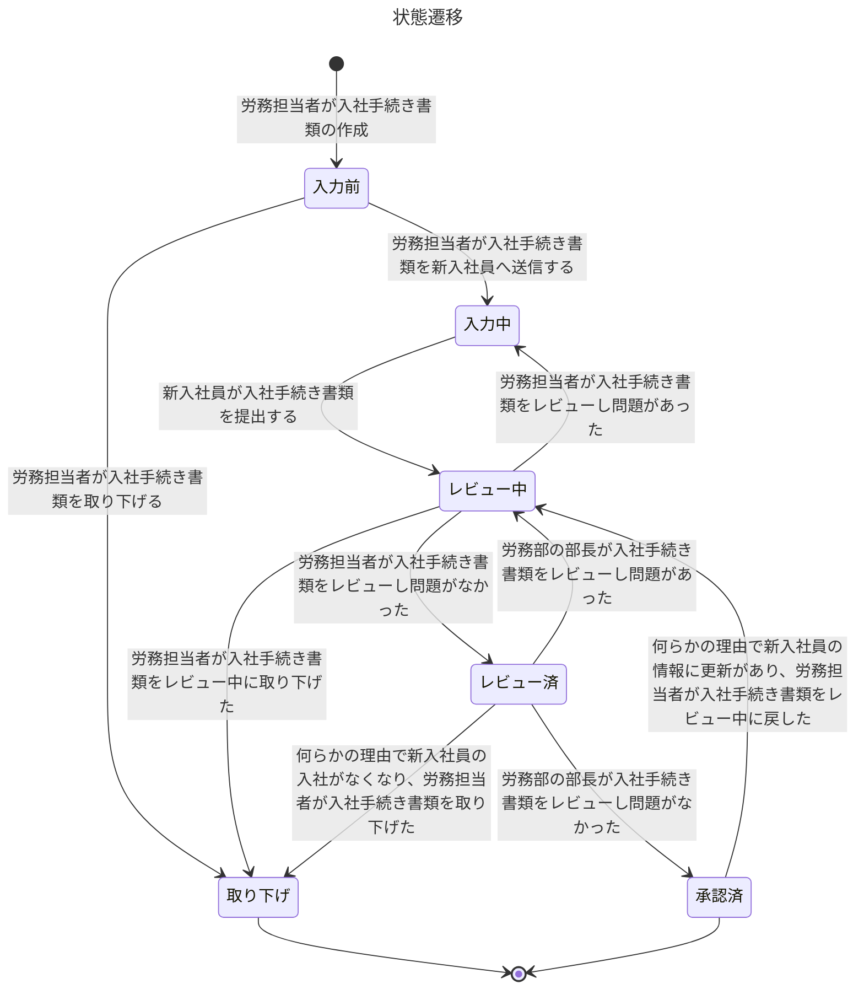

# タイトル

## 要求

ユーザーの要求を記述してください。
具体的には下記のサブ項目を記述してください。
ただし全部埋めなくても良いです。

要求は「Whyを分解する場所」です。要件・仕様を導くための Why の塊となります。

「何を作るか」ではなく「なぜ作るか」を構造化する場所

### 対象ユーザー・文脈

「誰の、どんな状況の話か？」を記述してください。

下記の質問に答えられるようなものを目指してください。
ただし全ての質問に答える必要はありません。

- 主な対象ユーザーは誰か？
- そのユーザーはどんな立場・役割か？
- どんな業務・生活の流れの中でこの要求が発生しているか？
- いつ・どの頻度で発生する話か？

### 現在の課題・不満

「今、何がつらいのか？」を記述してください。

下記の質問に答えられるようなものを目指してください。
ただし全ての質問に答える必要はありません。

- ユーザーは何に困っているか？
- どの作業・体験が特につらいか？
- それはなぜ問題なのか？（時間・心理・コスト・リスクなど）
- どんな状態が「我慢できないライン」か？

### ユーザーの欲求・期待

「本当はどうなっていたいか？」を記述してください。

下記の質問に答えられるようなものを目指してください。
ただし全ての質問に答える必要はありません。

- ユーザーは何を達成したいのか？
- どんな状態になれば満足か？
- 何ができると「助かる」「嬉しい」と感じるか？
- 現実的でなくても、理想像は何か？

### 成功のイメージ

「これが満たされたら、何が変わるのか？」を記述してください。

下記の質問に答えられるようなものを目指してください。
ただし全ての質問に答える必要はありません。

- この要求が満たされると、ユーザーの何が変わるか？
- 業務・行動・判断はどう変化するか？
- 課題はどの程度軽減されるか？
- 逆に、満たされないと何が起き続けるか？

### 前提・スコープ外

「今回はやらないこと・割り切り」を記述してください。

下記の質問に答えられるようなものを目指してください。
ただし全ての質問に答える必要はありません。

- 今回の要求では扱わないことは何か？
- 将来やるかもしれないが、今回は対象外なものは？
- この要求を書く上で置いている前提は何か？

## 要件

要件は「仕様の一歩手前」で止める形で記述してください。
❌ API / DB / 画面 / 状態遷移を書き始める → 仕様
❌ 実装手段（Web / バッチ / 人手）を書く → 仕様寄り
✅ 「この条件を満たさないとダメ」という 制約・条件・性質を書く → 要件

つまり要件は、「どう作るか」は書かないが、「こうでなければならない」を明確に記述します。

記述形式は下記となります。

- 分類はするが、チェックリスト型
- 「Yes/No」で判断できる粒度
- 後続の仕様セクションと1対1対応しない

### 機能要件

「何ができなければならないか？」を記述してください。

- ユーザーができる必要のあることは何か？
- システムが提供すべき振る舞いは何か？
- どの利用者に、どの操作・結果が必要か？

下記は記入例です。

- 労務担当者は入社手続き書類の進捗状態を把握できる必要がある
- 新入社員は自分の入社手続き書類を提出できる必要がある
- 労務部長は承認・差戻しを行える必要がある

### 業務・運用要件

「業務として成立するための条件は？」を記述してください。

- 現実の業務フロー上、成立していないと困る条件は？
- 人・組織・運用とどう関わる必要があるか？
- 運用負荷を増やさないための前提は？

下記は記入例です。

- 書類の承認フローは現行の労務業務と大きく乖離しないこと
- 繁忙期でも特別な運用を追加せずに利用できること
- 労務担当者が属人対応しなくても進捗が分かること

### 非機能要件

「どんな性質・品質である必要があるか？」を記述してください。

- パフォーマンス・可用性・セキュリティの制約は？
- UXや使いやすさに関する条件は？
- スケール・将来拡張に関する前提は？

必要に応じて分けてください

- パフォーマンス
- セキュリティ
- 可用性
- ユーザビリティ

下記は記入例です。

- 新入社員がITに不慣れでも迷わず操作できること
- 書類データは適切な権限管理のもとでのみ閲覧できること
- 同時に複数の入社手続きが進行しても問題なく利用できること

### データ・情報要件

「何の情報を扱う必要があるか？」を記述してください。

- 扱う必要のある情報の種類は何か？
- 誰がどの情報を見られる必要があるか？
- 情報の正確性・更新性に関する条件は？

下記は記入例です。

- 入社手続き書類には個人情報が含まれる
- 新入社員は自分自身の情報のみを閲覧・更新できる
- 承認履歴が後から確認できる必要がある

### 制約条件

「自由に決められないこと」を記述してください。

- 技術的・組織的に制約されていることは？
- 既存システム・ルールとの整合は？
- 法令・規程などの制約は？

下記は記入例です。

- 個人情報保護の観点から、アクセスログを保持する必要がある
- 既存の労務フローを大きく変更しないこと
- Webブラウザから利用できることが望ましい

### 要件の優先度・段階

「全部同時に満たす必要はあるか？」を記述してください。

- Must / Should / Nice to have に分けると？
- 初期リリースで必須なものは？
- 後回しにできる条件は？

下記は記入例です。

- Must: 書類の提出・レビュー・承認ができること
- Should: 承認状況の通知が行えること
- Nice to have: 書類入力の自動補完

## 仕様

### 利用者

この製品のユーザーを定義してください。
下記は記入例です。
労務管理を実施するSaaSの利用者を想定しています。

- 労務部の部長
  - 概要
    - 労務部の部長さん
  - 権限
    - 労務部の部長は提出された入社手続き書類を承認できる
- 労務担当者
  - 概要
    - 部長の下で働いている、労務チームのメンバー。
  - 権限
    - 労務担当者は提出された入社手続き書類を閲覧できる
    - 労務担当者は提出された入社手続き書類を更新できる
    - 労務担当者は提出された入社手続き書類を差戻しできる
- 新入社員
  - 概要
    - 新入社員です
  - 権限
    - 新入社員は自分の入社手続き書類を閲覧できる
    - 新入社員は自分の入社手続き書類を更新できる
    - 新入社員は自分の入社手続き書類を提出できる

### 入社手続き書類の状態

要件を説明する上で何らかの状態があるならば、その状態を定義してください。
状態の遷移については、MermaidのState diagramsを用いて記述してください。

下記は記入例です。

- 入力前
  - 概要
    - 新入社員が入社手続き書類を入力する前の状態
    - 労務担当者が入社手続き書類を作成中の状態
- 入力中
  - 概要
    - 新入社員が入社手続き書類を入力中である状態
- レビュー中
  - 概要
    - 労務担当者が入社手続き書類をレビュー中である状態
- レビュー済
  - 概要
    - 労務担当者が入社手続き書類をレビュー済である状態
- 承認済
  - 概要
    - 労務部の部長が入社手続き書類を承認済である状態

### ユースケース

記述してください。
